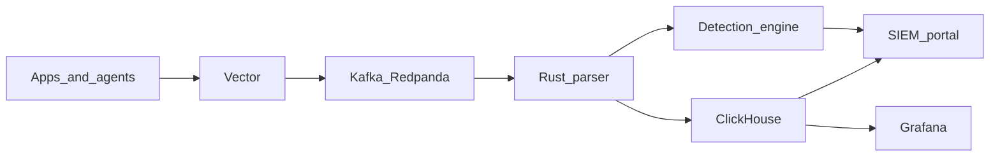

### Hi there 👋

I'm **Senri** — full-stack developer at [Protonoro](https://protonoro.com/), focused on **web platforms**, **real-time systems**, and **observability**.

I design and ship production tooling: from parsing pipelines and SIEM backends to React portals and Docker/Kubernetes deployments. Currently co-building products at [@PROTONORO-LTD](https://github.com/PROTONORO-LTD).

  
  
  

---

### What I build

#### [thread-sync](https://github.com/Davitushka/thread-sync) — production-grade SIEM

Open-source security analytics platform for microservice environments.

- **Rust parser** — HTTP ingest, Kafka pipeline, PII redaction, normalization (&lt;5ms p99 parse)
- **React SOC portal** — analyst suite, real-time updates, case management UI
- **Data plane** — ClickHouse storage, Redis state, Sigma-based detection engine
- **Observability** — Grafana dashboards, Prometheus metrics, Vector aggregation
- **Deploy** — Docker Compose for local/prod-like stacks, Kubernetes manifests
- **Scale targets** — 10k → 50k EPS, critical alerts ≤ 30s from event

#### Protonoro Timer — full-stack productivity app

- Full-stack timer product at **@PROTONORO-LTD** (frontend + backend)
- Built for daily focus workflows and team productivity
- Commercial codebase — showcased here, not open-sourced

---

### Architecture (thread-sync)

**Components:** `rust-parser` · `siem-portal` · `detection-engine-rs` · `case-management-rs` · `vector` · `deploy/docker` · `deploy/k8s`

---

### Tech stack

**Languages**

**Frontend**

**Data and messaging**

**Ops and observability**

---

<b>Stats and activity</b>

 

  
  

  

  

---

**Open to collaboration** — reach out via [protonoro.com](https://protonoro.com/) or [email](mailto:aid128638caides@gmail.com).
