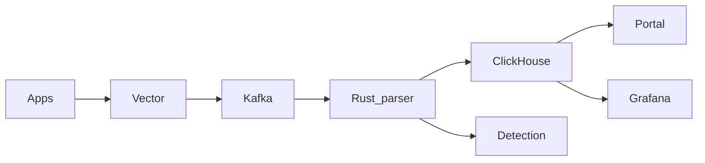

 

  

---

### About me

👋 I'm **Senri** — full-stack developer at **[Protonoro](https://protonoro.com/)** (he/him).

🔭 Building **web platforms**, **real-time systems**, and **observability** tooling.

🚀 Focus: **Rust** parsers · **React** portals · **.NET** services · **ClickHouse** / **Kafka** data planes.

🏢 Co-building [@PROTONORO-LTD](https://github.com/PROTONORO-LTD) — [Protonoro Timer](https://github.com/PROTONORO-LTD) & **[thread-sync](https://github.com/Davitushka/thread-sync)** (open-source SIEM).

📫 **protonoro.com** · **aid128638caides@gmail.com**

---

> Tip: the sections below act like tabs — click to expand. For the full experience visit the **[live portfolio](https://davitushka.github.io/)**.

<b>🛠 Technology stack</b>

 

<b>🚀 Projects and architecture</b>

 

#### [thread-sync](https://github.com/Davitushka/thread-sync)

Production-grade SIEM — Rust parser, React SOC portal, ClickHouse, Kafka, Grafana, Docker/K8s.

- 10k → 50k EPS · alerts ≤ 30s · parse &lt;5ms p99

#### Protonoro Timer

Full-stack productivity app @ **PROTONORO-LTD** (commercial, not open-sourced).

 

<b>📊 Stats and activity</b>

 

 

 

---

**Thanks for stopping by — open to collaboration**

 

